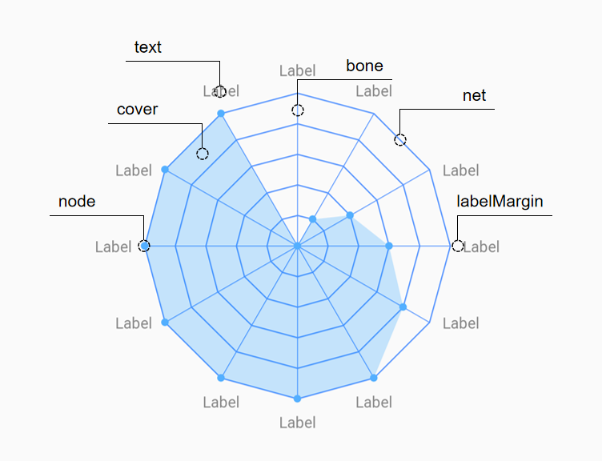

# RadarView [雷达图]
### 运行效果图

### 雷达图结构分析


对雷达图进行结构拆分，得到一个清晰的思路，这些结构也就是需要绘制的部分。为了能够有更好的扩展性，我将它们作为可定制的属性暴露出来，以下是结构属性表：

结构|相关属性|描述
---|---|---
bone|boneColor|骨架颜色
-|boneWidth|骨架宽度
net|netColor|网线颜色
-|netWidth|网线宽度
node|nodeColor|结点颜色
-|nodeRadius|结点半径
cover|coverColor|覆盖层（由各种属性的值组成的覆盖层）颜色
text|textColor|文本颜色
-|textSize|文本大小
-|labelMargin|文本与雷达图间距

### 如何使用？以下是上面效果图的代码：
#### xml
```xml
<win.smartown.library.radarview.RadarView
    android:id="@+id/radar"
    android:layout_width="match_parent"
    android:layout_height="match_parent"
    app:boneColor="#5392FF"
    app:boneWidth="0.5dp"
    app:coverColor="#380392FF"
    app:labelMargin="10dp"
    app:netColor="#5392FF"
    app:netWidth="1dp"
    app:nodeColor="#53AFFF"
    app:nodeRadius="3dp"
    app:textColor="#868686"
    app:textSize="12sp">
</win.smartown.library.radarview.RadarView>
```
#### 设置适配器
```java
        RadarView radarView = findViewById(R.id.radar);
        radarView.setAdapter(new RadarAdapter() {
            @Override
            public int getItemCount() {
                return 12;
            }

            @Override
            public int getMaxValue() {
                return 5;
            }

            @Override
            public int getValue(int position) {
                if (position > getMaxValue()) {
                    return getMaxValue();
                }
                return position;
            }

            @Override
            public String getName(int position) {
                return "Label" + position;
            }
        });
```
### 难点总结
- 主要就是要计算各个点的坐标，每一个交叉点的坐标需要计算出来，好在这是一个非常标准的数学模型，可以通过公式计算出来，以下是计算坐标的代码：
```java
//[centerX,centerY]为中心点坐标，radius为待求坐标到中心点的距离
float x = (float) (centerX + radius * Math.cos(degree * Math.PI / 180));
float y = (float) (centerY + radius * Math.sin(degree * Math.PI / 180));
```